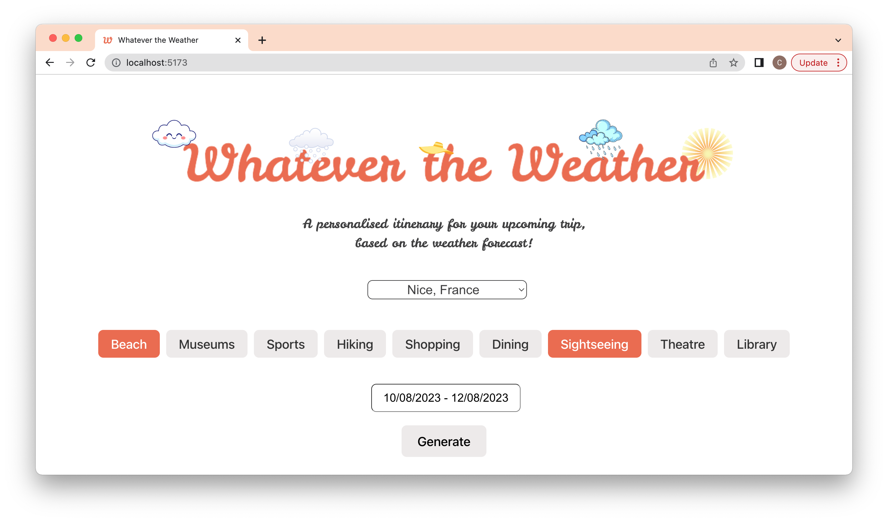

# Whatever the Weather

When you’re travelling, constantly checking the weather forecast and planning your activities accordingly can become a real drag. **Whatever the Weather** solves this for you! It’s a single-page web application that generates an itinerary of activity recommendations for each day of your trip, based on a live daily weather forecast.

We created **Whatever the Weather** during our final two-week engineering project at the [Makers Academy](https://github.com/makersacademy) coding bootcamp. We worked collaboratively, following Agile practices, to design and build the app from scratch.

## How to run the project

Install dependencies by running `npm install` in the `/api` and `/frontend` directories.

To start the `api` server:

```shell
npm start
```

To start the `frontend` dev server:

```shell
npm run dev
```

Then open `http://localhost:5173/` in your browser.

To generate an itinerary, you will need a (free) subscription to OpenWeather's ["One Call by Call" subscription plan](https://openweathermap.org/api/one-call-3). Once you have a valid API key, create an `.env` file in `/api` with the following environment variable definition:

```text
OPENWEATHER_API_KEY={your_key}
```

To use the email functionality, configure the security settings of an email address you own to be [compatible with STMP transport via `Nodemailer`](https://nodemailer.com/smtp/). Update the code of `emailController.js` accordingly, and define the following environment variables:

```text
EMAIL_ACCOUNT={your_email_address}
EMAIL_PASS={your_email_password}
```

### How to run tests

To run Cypress tests using Launchpad, in `/frontend`:

```shell
npm run test
```

To run Jest tests, in `/api`:

```shell
npm test
```

## Webpage view




## Our process

- Created a team charter where we set out our working practices, team goals, personal goals and team values
- Set about defining the product, creating user stories and narrowing down a Minimum Viable Product
- Set out a sprint schedule of 2/3 day sprints and organised team meetings and retros
- Used Excallidraw to create workflow diagrams and wireframes
- Used trello tickets to break down the project into clear, concise and manageable units of work

## Areas for future development

There is significant scope for `recommendActivities`, the function that handles the business logic, to be expanded and developed:

- Ensure any repeated activities are scheduled as far apart as possible
- Maintaining optimum weather/activity combinations for non user-selected suggestions
- Adding a min/max temperature filter

Other potential areas for development:

- A more tailored list of activity options for each city
- Include links for suggested activities
- Ability for the user to force certain activity/day combinations
- An additional page for historical weather patterns for a given city
- User login functionality to save preferences and itineraries

## Technologies

This project was built using Node v20.2, and uses the following technologies:

- Express.js – backend API server framework
- React.js – frontend UI library
- Vite – frontend build tool (replacing `create-react-app`)
- Jest – backend testing framework
- SuperTest – HTTP server testing library
- Cypress – frontend testing framework
- ESLint – code analysis
- dotenv – environment variable management
- nodemon – automatic server restarting
- nodemailer – email sending
- react-datepicker – Datepicker component
- npm – dependency management

## Credits

- [Ann Chayada Sansiriwong](https://github.com/csanann)
- [Caroline Evans](https://github.com/cvass1)
- [Faridat Abdulsalami](https://github.com/fa385)
- [Ha Nguyen](https://github.com/hanguyen21)
- [Louis Claremont](https://github.com/lplclaremont)
- [Will Davies](https://github.com/wimdavies)
